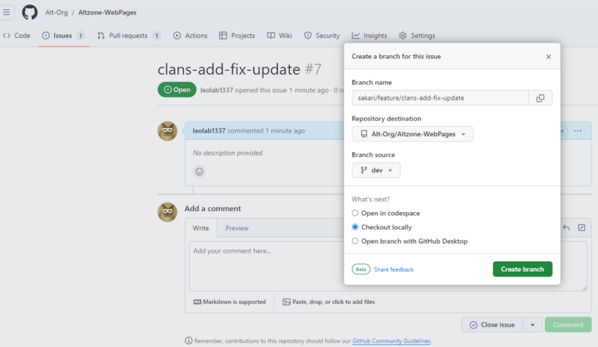
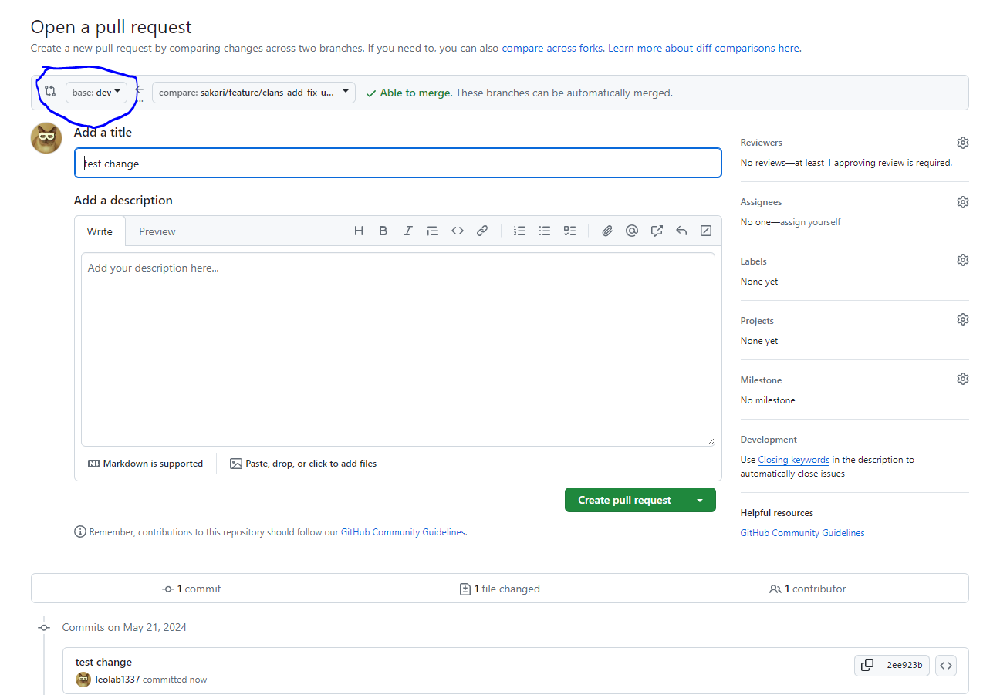

# Branching Strategy

This document outlines the branching strategy and naming conventions to be followed in this project.

## Branch Prefixes

- `feature`: For new features
- `bug`: For fixing bugs
- `hotfix`: For critical fixes
- `enhancement`: For improvements to existing features
- `refactor`: For code refactoring
- `docs`: For documentation updates
- `test`: For adding or updating tests
- `chore`: For tasks not related to the application code (e.g., dependency updates)
- `perf`: For performance improvements
- `style`: For code style changes

## Naming Convention

Branches should be named with the format: `<developer>/<prefix>/<shortdescription>`

## Example

- `mikhail/feature/add-authentication`
- `alice/bug/fix-login-issue`
- `bob/hotfix/resolve-database-error`

## To Create a Branch

Please use the Issues page on GitHub (see pictures below).

## Pull Request
When the task is done please make a pull request to the "dev" branch  (see picture below).

### Please also write the following text to the description: "Fixes #issue_number". So we can close the related issue automatically. 

## Notes
- Do not do multiple things in a single branch.

